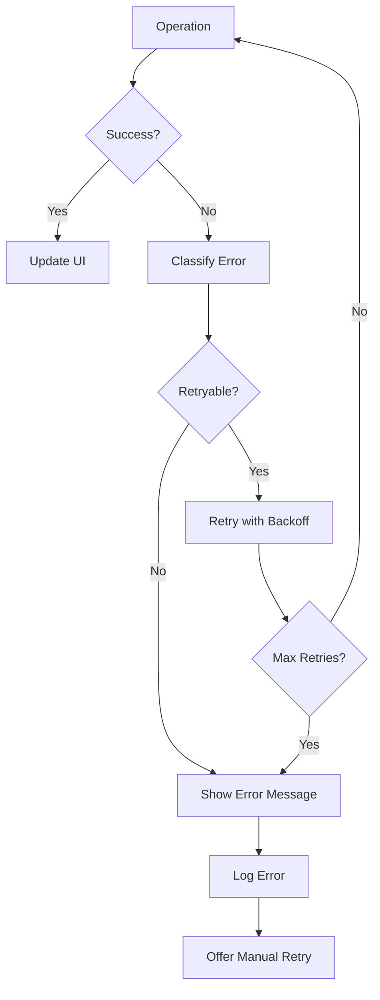

# Design Document

## Overview

O sistema atualmente possui uma estrutura de calendário que funciona apenas no frontend, sem persistência adequada no banco de dados. Este design implementa uma camada de persistência robusta usando Supabase, garantindo que os dados do calendário sejam salvos, sincronizados e recuperados corretamente.

A solução utiliza a arquitetura existente do projeto (React + TypeScript + Supabase) e aproveita as tabelas já definidas no banco (`calendars` e `calendar_days`), além dos recursos nativos do Supabase como real-time subscriptions e cache automático.

## Architecture

### Camada de Dados (Data Layer)
- **Supabase Client**: Já configurado em `src/lib/supabase/client.ts`
- **Database Schema**: Utiliza as tabelas existentes `calendars` e `calendar_days`
- **Types**: Tipos TypeScript já definidos em `src/lib/supabase/types.ts`

### Camada de Serviços (Service Layer)
- **CalendarService**: Gerencia operações CRUD para calendários
- **CalendarDayService**: Gerencia operações CRUD para dias do calendário
- **SyncService**: Gerencia sincronização e cache offline

### Camada de Estado (State Layer)
- **Supabase Real-time**: Para sincronização em tempo real e cache automático
- **Custom Hooks**: Hooks específicos para operações de calendário usando Supabase
- **Local State**: Gerenciamento de estado local com React hooks
- **Error Handling**: Tratamento centralizado de erros

### Camada de Apresentação (Presentation Layer)
- **Componentes existentes**: `CalendarGrid`, `DayCard`, etc.
- **Loading States**: Indicadores de carregamento
- **Error States**: Tratamento de erros na UI

## Components and Interfaces

### 1. Calendar Service Interface

```typescript
interface CalendarService {
  // Calendar CRUD operations
  createCalendar(data: CreateCalendarData): Promise<Calendar>
  getCalendar(id: string): Promise<Calendar | null>
  updateCalendar(id: string, data: UpdateCalendarData): Promise<Calendar>
  deleteCalendar(id: string): Promise<void>
  getUserCalendars(userId: string): Promise<Calendar[]>
  
  // Calendar Day operations
  createCalendarDay(data: CreateCalendarDayData): Promise<CalendarDay>
  getCalendarDays(calendarId: string): Promise<CalendarDay[]>
  updateCalendarDay(id: string, data: UpdateCalendarDayData): Promise<CalendarDay>
  deleteCalendarDay(id: string): Promise<void>
  
  // Bulk operations
  createMultipleCalendarDays(calendarId: string, days: CreateCalendarDayData[]): Promise<CalendarDay[]>
  
  // Analytics operations
  incrementCalendarViews(calendarId: string): Promise<void>
  incrementCalendarShares(calendarId: string): Promise<void>
  incrementDayOpened(dayId: string): Promise<void>
}
```

### 2. Custom Hooks Interface

```typescript
// Calendar hooks
const useCalendar = (calendarId: string) => {
  data: Calendar | undefined
  isLoading: boolean
  error: Error | null
  refetch: () => void
}

const useCalendarDays = (calendarId: string) => {
  data: CalendarDay[] | undefined
  isLoading: boolean
  error: Error | null
  refetch: () => void
}

const useCreateCalendar = () => {
  mutate: (data: CreateCalendarData) => void
  isLoading: boolean
  error: Error | null
}

const useUpdateCalendarDay = () => {
  mutate: (data: { id: string, updates: UpdateCalendarDayData }) => void
  isLoading: boolean
  error: Error | null
}
```

### 3. Error Handling Interface

```typescript
interface CalendarError {
  code: string
  message: string
  details?: any
}

interface ErrorHandler {
  handleDatabaseError(error: any): CalendarError
  handleNetworkError(error: any): CalendarError
  handleValidationError(error: any): CalendarError
}
```

## Data Models

### Calendar Model (Existing)
```typescript
interface Calendar {
  id: string
  title: string
  owner_id: string
  theme_id: string
  duration: number
  start_date: string | null
  status: 'ativo' | 'rascunho' | 'finalizado'
  privacy: 'public' | 'private'
  views: number | null
  likes: number | null
  shares: number | null
  created_at: string | null
  updated_at: string | null
}
```

### Calendar Day Model (Existing)
```typescript
interface CalendarDay {
  id: string
  calendar_id: string
  day: number
  label: string | null
  message: string | null
  content_type: 'text' | 'photo' | 'gif' | 'link' | null
  url: string | null
  opened_count: number | null
  created_at: string | null
  updated_at: string | null
}
```

### Extended Models for UI
```typescript
interface CalendarWithDays extends Calendar {
  days: CalendarDay[]
}

interface CalendarDayWithStatus extends CalendarDay {
  status: 'locked' | 'available' | 'opened'
  timeLeft?: string
  hasSpecialContent?: boolean
}
```

## Error Handling

### Error Types
1. **Database Errors**: Conexão, timeout, constraint violations
2. **Network Errors**: Conectividade, latência
3. **Validation Errors**: Dados inválidos, campos obrigatórios
4. **Authentication Errors**: Usuário não autenticado, permissões

### Error Recovery Strategies
1. **Retry Logic**: Tentativas automáticas para operações falhadas
2. **Offline Support**: Cache local para operações offline
3. **User Feedback**: Mensagens claras de erro e ações sugeridas
4. **Graceful Degradation**: Funcionalidade limitada quando serviços estão indisponíveis

### Error Handling Flow


## Testing Strategy

### Unit Tests
- **Services**: Testar todas as operações CRUD
- **Hooks**: Testar comportamento de loading, error e success states
- **Utils**: Testar funções de validação e transformação de dados

### Integration Tests
- **Database Operations**: Testar operações reais com banco de teste
- **API Integration**: Testar integração com Supabase
- **Error Scenarios**: Testar cenários de erro e recovery

### E2E Tests
- **Calendar Creation Flow**: Criar calendário completo
- **Day Interaction Flow**: Abrir dias, salvar progresso
- **Offline/Online Sync**: Testar sincronização após reconexão

### Performance Tests
- **Load Testing**: Testar com múltiplos calendários e dias
- **Memory Usage**: Verificar vazamentos de memória
- **Network Efficiency**: Otimizar número de requests

## Implementation Phases

### Phase 1: Core Infrastructure
- Implementar CalendarService e CalendarDayService
- Criar custom hooks básicos
- Implementar error handling básico

### Phase 2: UI Integration
- Integrar serviços com componentes existentes
- Adicionar loading states
- Implementar error states na UI

### Phase 3: Advanced Features
- Implementar cache offline
- Adicionar retry logic
- Implementar analytics tracking

### Phase 4: Optimization
- Otimizar performance
- Implementar lazy loading
- Adicionar prefetching

## Security Considerations

### Authentication
- Verificar autenticação antes de operações
- Implementar Row Level Security (RLS) no Supabase
- Validar ownership de calendários

### Data Validation
- Validar dados no frontend e backend
- Sanitizar inputs do usuário
- Implementar rate limiting

### Privacy
- Respeitar configurações de privacidade dos calendários
- Implementar controle de acesso baseado em roles
- Audit log para operações sensíveis