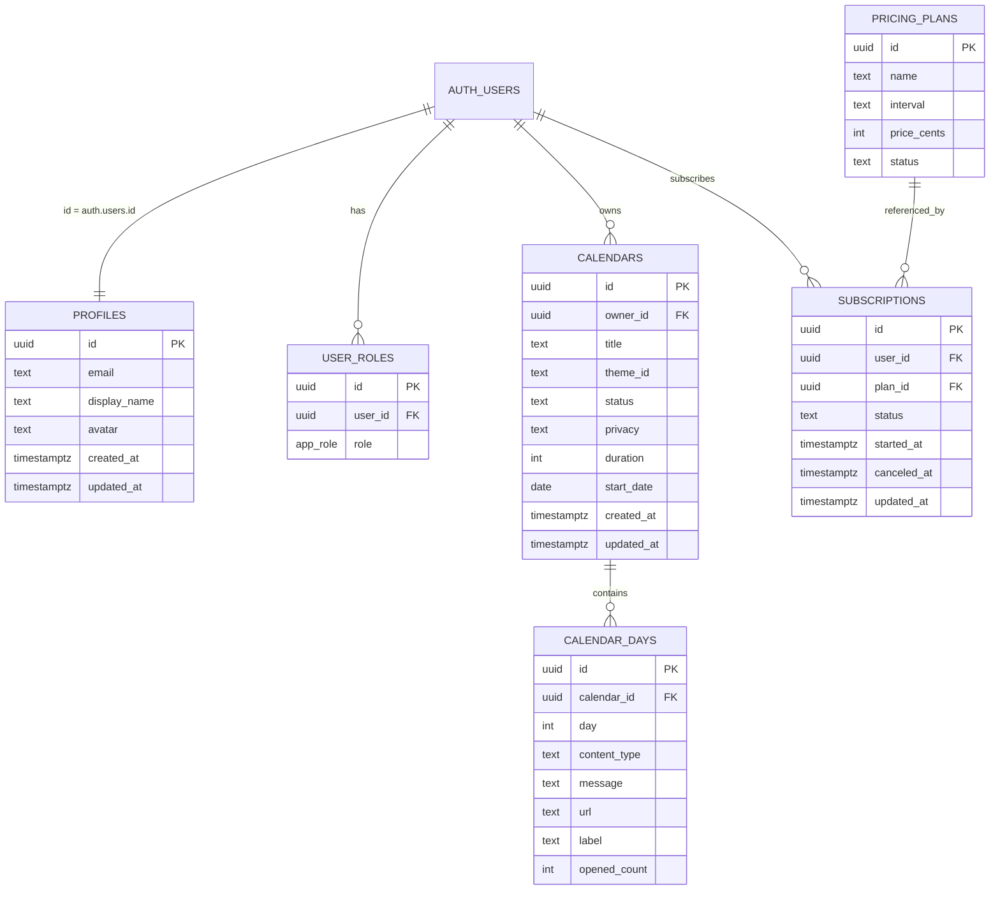

# Plano de Migração — Offline (localStorage) → Supabase

> Este documento descreve **como migrar** o Fresta do modo offline (localStorage) para um backend com banco de dados, autenticação, RLS e Storage.
> 
> **Importante:** este plano é **apenas documentação**. Não executa integração nem cria recursos.

## 1) Objetivo e princípios

### Objetivo
Migrar as funcionalidades atuais para persistência real:
- Autenticação + sessão real
- Perfis de usuário
- Calendários e “portas” (dias)
- Temas customizados
- Link público / privacidade
- Planos / assinaturas (estrutura pronta, cobrança pode vir depois)

### Princípios obrigatórios
- **RLS em tudo que contém dados de usuário**.
- **Não armazenar arquivos/imagens no banco** (nem base64, nem BYTEA). Usar **Storage** e salvar **apenas URL/path** no banco.
- **Roles/papéis em tabela separada** (nunca em `profiles` / `users`).
- Evitar recursão em RLS: usar função `security definer` (ex.: `has_role`).

---

## 2) Modelo de dados (tabelas)

> Sugestão: começar pelo B2C (calendários/portas) e só depois evoluir B2B/Admin.

### 2.1 Auth + Perfis
Tabela: `public.profiles`

Campos sugeridos:
- `id uuid` (PK; FK para `auth.users(id)` com `ON DELETE CASCADE`)
- `email text` *(opcional; útil para UI, mas o “source of truth” é o auth)*
- `display_name text`
- `avatar text` *(emoji ou URL/path no Storage)*
- `created_at timestamptz default now()`
- `updated_at timestamptz default now()`

Automação:
- Trigger no signup para criar o perfil.

### 2.2 Roles (segurança)
Enum: `public.app_role` (`admin`, `moderator`, `user`…)

Tabela: `public.user_roles`
- `id uuid` PK
- `user_id uuid` FK `auth.users(id)`
- `role app_role`
- Unique `(user_id, role)`

Função:
- `public.has_role(_user_id uuid, _role app_role) returns boolean` como `SECURITY DEFINER`.

### 2.3 Calendários
Tabela: `public.calendars`
- `id uuid` PK
- `owner_id uuid not null` (auth)
- `title text not null`
- `theme_id text not null` *(ou enum depois)*
- `status text not null` (`ativo|rascunho|finalizado`)
- `privacy text not null` (`public|private`)
- `duration int not null`
- `start_date date null`
- `created_at`, `updated_at`

### 2.4 Portas / Dias
Tabela: `public.calendar_days`
- `id uuid` PK
- `calendar_id uuid not null` FK `calendars(id)` ON DELETE CASCADE
- `day int not null` (1..duration)
- `content_type text null` (`text|photo|gif|link`)
- `message text null`
- `url text null` *(URL/path no Storage ou link externo)*
- `label text null`
- `opened_count int default 0`
- Unique `(calendar_id, day)`

### 2.5 Temas customizados (opções)
**Opção A (recomendada):** manter `BASE_THEMES` no frontend e salvar **apenas overrides** do usuário.

Tabela: `public.theme_overrides`
- `id uuid` PK
- `owner_id uuid not null`
- `base_theme_id text not null`
- `enabled boolean default true`
- `custom_name text null`
- `custom_emoji text null`
- `created_at`, `updated_at`

**Opção B (mais flexível):** tabela `public.themes` com temas do sistema + temas do usuário.

### 2.6 Planos e Assinaturas (estrutura)
Tabela: `public.pricing_plans`
- `id uuid` PK
- `name text`
- `interval text` (`month|year`)
- `price_cents int`
- `status text` (`active|archived`)
- `created_at`, `updated_at`

Tabela: `public.subscriptions`
- `id uuid` PK
- `user_id uuid not null`
- `plan_id uuid not null`
- `status text` (`trialing|active|canceled`)
- `started_at timestamptz`
- `canceled_at timestamptz null`
- `updated_at timestamptz`

---

## 3) Storage (arquivos)

### 3.1 Buckets sugeridos
- `avatars` (avatar do usuário)
- `day-media` (fotos/GIFs anexados às portas)

### 3.2 Padrão obrigatório
- No banco, salvar **somente**:
  - URL pública
  - ou `path` do objeto no Storage (ex.: `day-media/<userId>/<calendarId>/dia-05.png`)
- Nunca salvar binário/base64 no banco.

### 3.3 Acesso (alto nível)
- Usuário pode **escrever** apenas em paths do próprio usuário.
- Leitura depende do caso:
  - `avatars`: pode ser público
  - `day-media`: pode ser privado e servido via URLs assinadas (quando necessário)

---

## 4) RLS (Row Level Security)

> A regra é: **sem RLS, não sobe**.

### 4.1 `profiles`
- SELECT: usuário lê seu próprio perfil
- UPDATE: usuário edita seu próprio perfil
- Admin: pode listar/ler perfis via `has_role`

### 4.2 `calendars`
- INSERT/UPDATE/DELETE: apenas `owner_id = auth.uid()`
- SELECT:
  - dono lê os próprios
  - público (para `/c/:id`): permitir ler calendários `privacy='public'`

### 4.3 `calendar_days`
- INSERT/UPDATE/DELETE: apenas dono do calendário
- SELECT:
  - dono lê tudo
  - público lê apenas dias vinculados a calendários públicos

### 4.4 `pricing_plans`
- SELECT: público (para página de preços)
- mutações: apenas admin

### 4.5 `subscriptions`
- SELECT: usuário lê as próprias
- mutações: tipicamente feitas por servidor/webhook (definir depois)

---

## 5) Rotas públicas vs privadas (impacto no app)

### Públicas
- `/` landing
- `/entrar`
- `/premium`
- `/c/:id` (visualização por link)

### Privadas (criador)
- `/meus-calendarios`
- `/criar`
- `/calendario/:id`
- `/editar-dia/:calendarId/:dia`
- `/perfil`, `/conta/configuracoes`

### Regras propostas para `/c/:id`
- Se `privacy='public'`: qualquer visitante pode ver.
- Se `privacy='private'`: mostrar bloqueio (e opcionalmente pedir login).

---

## 6) Estratégia de migração do código (corte do localStorage)

### Fase A — Preparação (sem mudar UX)
1. Criar schema + RLS + buckets.
2. Implementar auth real + `profiles`.
3. Criar camada de repositórios em `src/lib/data/`:
   - `CalendarsRepository`
   - `ThemesRepository`
   - `BillingRepository`
4. Implementar dois backends (mesma interface):
   - `offline/*` (usa `src/lib/offline/db.ts`)
   - `supabase/*` (usa banco)
5. Feature flag para alternar (`offline` vs `supabase`).

### Fase B — Dual-write (opcional)
- Em ações críticas (criar/editar calendário), escrever em ambos temporariamente para validar.

### Fase C — Cutover
- Trocar flag para `supabase`.
- Manter “leitura do offline” apenas para importação.

### Fase D — Importador
- Tela "Importar meus dados do modo offline":
  - lê `localStorage`
  - cria calendários/dias no banco
  - envia mídias para Storage quando aplicável
  - salva apenas paths/URLs

---

## 7) Mapeamento direto do modelo atual (offline → banco)

`CalendarEntity` (offline) → `calendars` + `calendar_days`

`DayContent`:
- `text.message` → `calendar_days.message`
- `photo.url` / `gif.url` → `calendar_days.url`
- `link.url` + `label` → `calendar_days.url` + `calendar_days.label`

---

## 8) Diagrama (ER) — visão rápida

